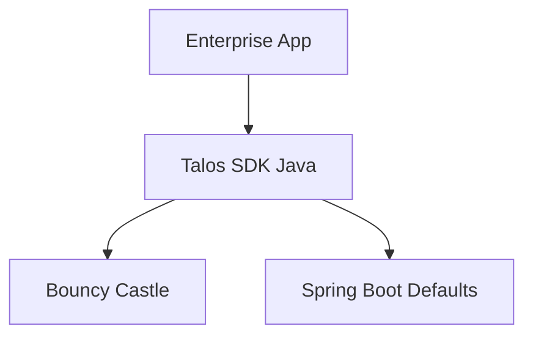

# Talos SDK for Java

**Repo Role**: Official Java/JVM implementation of the Talos Protocol for enterprise integration.

## Abstract
The Talos SDK for Java brings the security of the Talos Protocol to the enterprise ecosystem. It provides a Spring-compatible, thread-safe implementation of the Double Ratchet, suitable for integration into large-scale legacy systems and modern Kotlin/Java microservices.

## Introduction
Enterprise environments often require strict adherence to established platforms. `talos-sdk-java` allows existing Java applications to participate in the autonomous agent network, bridging the gap between legacy infrastructure and the new AI economy.

## System Architecture



## Technical Design
### Modules
- **com.talosprotocol.core**: Protocol logic.
- **com.talosprotocol.crypto**: Bouncy Castle integration.
- **com.talosprotocol.mcp**: Spring WebFlux adapters.

### Data Formats
- **POJOs**: Jackson-annotated classes for JSON serialization.

## Evaluation
**Status**: Stable.
- **Conformance**: Verified against `v1.1.0` vectors.

## Usage
### Quickstart
Add the Maven dependency:
```xml
<dependency>
    <groupId>com.talosprotocol</groupId>
    <artifactId>talos-sdk</artifactId>
</dependency>
```

### Common Workflows
1.  **Configure Bean**:
    ```java
    @Bean
    public TalosSession talosSession() { ... }
    ```

## Operational Interface
*   `make test`: Run JUnit tests.
*   `scripts/test.sh`: CI entrypoint.

## Security Considerations
*   **Threat Model**: Insider threat, supply chain attacks.
*   **Guarantees**:
    *   **Auditability**: Integrates with standard logging frameworks.

## References
1.  [Mathematical Security Proof](../talos-docs/Mathematical_Security_Proof.md)
2.  [Talos Contracts](../talos-contracts/README.md)
3.  [Talos Wiki](https://github.com/talosprotocol/talos/wiki)

## License

Licensed under the Apache License 2.0. See [LICENSE](LICENSE).
